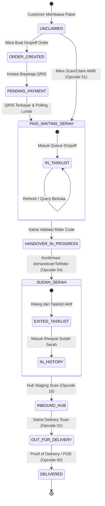

# ANTERAJA MAA — TRANSACTIONAL STATE MACHINE

Spesifikasi formal State Machine yang mengatur siklus hidup AWB, Order, Pembayaran, dan Tasklist.

---

```mermaid
stateDiagram-v2
    [*] --> UNCLAIMED: Customer Membawa Paket
    UNCLAIMED --> ORDER_CREATED: Mitra Buat Dropoff Order
    ORDER_CREATED --> PENDING_PAYMENT: Inisiasi Bayaraja QRIS
    PENDING_PAYMENT --> PAID_WAITING_SERAH: QRIS Terbayar & Polling Lunas
    UNCLAIMED --> PAID_WAITING_SERAH: Mitra Scan/Claim AWB (Opcode 51)
    
    state PAID_WAITING_SERAH {
        [*] --> IN_TASKLIST: Masuk Queue Dropoff
        IN_TASKLIST --> IN_TASKLIST: Refresh / Query Berkala
    }
    
    PAID_WAITING_SERAH --> HANDOVER_IN_PROGRESS: Satria Validasi Rider Code
    HANDOVER_IN_PROGRESS --> SUDAH_SERAH: Konfirmasi doHandoverToRider (Opcode 54)
    
    state SUDAH_SERAH {
        [*] --> EXITED_TASKLIST: Hilang dari Tasklist Aktif
        EXITED_TASKLIST --> IN_HISTORY: Masuk Riwayat Sudah Serah
    }
    
    SUDAH_SERAH --> INBOUND_HUB: Hub Staging Scan (Opcode 10)
    INBOUND_HUB --> OUT_FOR_DELIVERY: Satria Delivery Scan (Opcode 01)
    OUT_FOR_DELIVERY --> DELIVERED: Proof of Delivery / POD (Opcode 00)
    DELIVERED --> [*]
```
